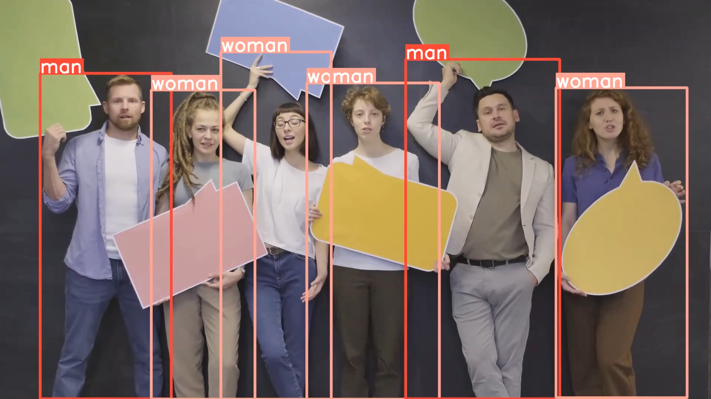

# YOLO World Command Line Interface

This Python script provides a command line interface (CLI) for running object detection using the YOLO-WORLD model. YOLO-WORLD is an advanced, real-time open-vocabulary object detection model that enhances the YOLO framework with vision-language modeling and pre-training on expansive datasets. This approach enables the detection of a broad array of objects in zero-shot scenarios with high efficiency and accuracy.

## Features

- **Open-Vocabulary Detection:** Leverages pre-trained weights and a novel architecture to detect objects beyond pre-defined categories.
- **Real-Time Performance:** Offers unmatched speed and efficiency for real-time applications.
- **Flexible Input Options:** Supports custom prompt lists and various source files for detection.
- **Customizable Confidence Threshold:** Allows users to set their own confidence threshold for detections.

## Prerequisites

Before running this script, ensure you have:

- Python 3.8 or later.
- Ultralytics YOLO package installed.
- Internet access for downloading pre-trained models (if not already downloaded).

## Installation

1. Clone the GitHub repository:
   ```
   git clone https://github.com/jasminaaa20/yolo-world.git
   cd yolo-world
   ```
2. Install ultralytics:
   ```
   pip install ultralytics
   ```
   


## Usage


Run the script from the command line, specifying the model, prompt list, source file, and confidence threshold:

```
python main.py --model yolov8l-world.pt --prompt_list "man,woman" --source data/sample_input.mp4 --conf 0.05
```
###


## Important Notes

- **Detection Confidence for Non-COCO Classes:** YOLO-WORLD's detection confidence for classes not present in the COCO dataset might be lower, necessitating a lower confidence threshold by default. This approach, however, might result in double detection of objects.
- **Agnostic NMS:** To mitigate the issue of double detections, `agnostic_nms` is set to true, enabling more precise object detection without redundant overlaps.

## YOLO-WORLD Overview

YOLO-WORLD introduces a novel framework that significantly enhances the open-vocabulary detection capabilities of the traditional YOLO detectors. By incorporating a Re-parameterizable Vision-Language Path Aggregation Network (RepVL-PAN) and region-text contrastive loss, YOLO-WORLD can efficiently detect a wide range of objects described by textual prompts in real-time. This model is pre-trained on large-scale datasets, including detection, grounding, and image-text datasets, making it capable of zero-shot detection with high efficiency and accuracy on standard benchmarks.

### Key Features:

- Real-time open-vocabulary object detection.
- Enhanced efficiency and accuracy with RepVL-PAN.
- Zero-shot detection capabilities using vision-language pre-training.

### Research and Development:

YOLO-WORLD has been developed and tested by leading researchers and has shown remarkable performance in open-vocabulary object detection tasks. For detailed information on YOLO-WORLD, including its architecture, training, and performance metrics, refer to the original research paper and GitHub repository:

- Research Paper: [YOLO-World: Real-Time Open-Vocabulary Object Detection](2401.17270.pdf)
- GitHub Repository: [AILab-CVC/YOLO-World](https://github.com/AILab-CVC/YOLO-World)

## Contributing

We welcome contributions to improve the script or documentation.
